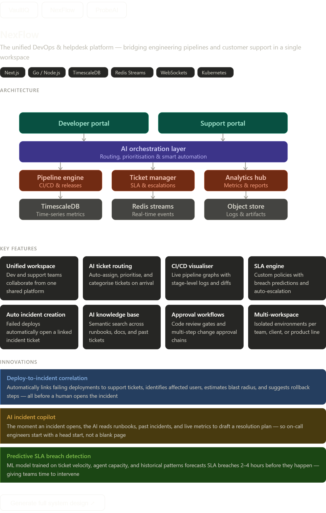

<div align="center">



# NexFlow

**Unified DevOps & Helpdesk Platform**

A full-stack monorepo combining project management, IT helpdesk, asset tracking, knowledge base, SLA monitoring, and AI-powered insights — all in one platform.

[](https://nexflow-sigma.vercel.app)
[](https://nextjs.org)
[](https://www.typescriptlang.org)
[](https://clerk.com)
[](LICENSE)

</div>

---

## 🌐 Live Links

| Service | URL | Status |
|---------|-----|--------|
| **Web App** | [nexflow-sigma.vercel.app](https://nexflow-sigma.vercel.app) | ✅ Live |
| **GitHub** | [github.com/gokulsenthilkumar3/NexFlow](https://github.com/gokulsenthilkumar3/NexFlow) | ✅ Public |
| **Vercel Dashboard** | [vercel.com/gokuls-projects-16278f90/nexflow](https://vercel.com/gokuls-projects-16278f90/nexflow) | ✅ Active |

---

## ✨ Features

- 🗂 **Project Boards** — Kanban-style sprint boards with drag-and-drop work item management
- 🎫 **Helpdesk Queue** — Priority-based ticket queue with SLA tracking and breach alerts
- 📦 **Asset Management** — IT asset lifecycle tracking (assign, maintain, retire)
- 📖 **Knowledge Base** — Categorized articles with full edit history
- 📊 **SLA Analytics** — Real-time SLA compliance dashboard with charts
- 📈 **Reports** — Bar, line, and pie chart reports across all modules
- 🤖 **AI Copilot** — AI-powered insights surfaced directly on the dashboard
- 🔔 **Live Sync** — Real-time updates via Socket.IO across all connected clients
- 🔐 **Auth** — Clerk-powered authentication with sign-in/sign-up flows

---

## 🏗 Architecture

NexFlow is a **Turborepo monorepo** with clearly separated apps, services, and shared packages.

```
NexFlow/
├── apps/
│   └── web-app/          # Next.js 16 frontend (React 19, Tailwind 4)
├── services/
│   ├── auth-service/     # NestJS — Clerk webhook sync, user management
│   ├── helpdesk-service/ # NestJS — Tickets, SLA, KB, comments
│   ├── project-service/  # NestJS — Work items, sprints, boards
│   └── asset-service/    # NestJS — Asset lifecycle management
├── packages/
│   ├── shared-types/     # Shared TypeScript interfaces across all services
│   └── eslint-config/    # Shared ESLint rules
├── functions/            # Firebase Cloud Functions (SSR wrapper)
├── docker-compose.yml    # Local dev stack (Postgres, Redis)
└── turbo.json            # Turborepo pipeline config
```

---

## 🛠 Tech Stack

| Layer | Technology |
|-------|------------|
| Frontend | Next.js 16, React 19, TypeScript, Tailwind CSS 4 |
| Auth | Clerk (`@clerk/nextjs` v7) |
| State | TanStack Query v5 |
| Drag & Drop | `@dnd-kit/core` |
| Charts | Recharts |
| Real-time | Socket.IO client |
| Backend | NestJS (per service) |
| Database | PostgreSQL + Prisma |
| Cache | Redis |
| Deployment | Vercel (frontend), Firebase (functions) |
| Monorepo | Turborepo |

---

## 🚀 Getting Started

### Prerequisites

- Node.js 20+
- Docker Desktop (for local Postgres + Redis)
- A [Clerk](https://clerk.com) account

### 1. Clone & Install

```bash
git clone https://github.com/gokulsenthilkumar3/NexFlow.git
cd NexFlow
npm install
```

### 2. Configure Environment

```bash
cp .env.example .env.local
```

Edit `.env.local` and fill in:

```env
# Clerk
NEXT_PUBLIC_CLERK_PUBLISHABLE_KEY=pk_test_...
CLERK_SECRET_KEY=sk_test_...
NEXT_PUBLIC_CLERK_SIGN_IN_URL=/sign-in
NEXT_PUBLIC_CLERK_SIGN_UP_URL=/sign-up

# Backend API
NEXT_PUBLIC_API_URL=http://localhost:3001
```

### 3. Start Local Services

```bash
# Start Postgres + Redis via Docker
docker-compose up -d

# Start all apps and services
npm run dev
```

The web app will be available at **http://localhost:3000**.

### 4. Build for Production

```bash
cd apps/web-app
npm run build
```

---

## 📦 Deployment

### Frontend — Vercel

```bash
cd apps/web-app
vercel --prod
```

Add these environment variables in the [Vercel dashboard](https://vercel.com/gokuls-projects-16278f90/nexflow/settings/environment-variables):

```
NEXT_PUBLIC_CLERK_PUBLISHABLE_KEY
CLERK_SECRET_KEY
NEXT_PUBLIC_CLERK_SIGN_IN_URL=/sign-in
NEXT_PUBLIC_CLERK_SIGN_UP_URL=/sign-up
NEXT_PUBLIC_API_URL
```

### Backend Services — Render / Railway

Each service inside `services/` is an independent NestJS app with its own `Dockerfile`. Deploy each to Render or Railway, then set `NEXT_PUBLIC_API_URL` in Vercel.

---

## 🤝 Contributing

See [CONTRIBUTING.md](CONTRIBUTING.md) for guidelines on branching, commit conventions, and pull request standards.

---

## 📄 License

MIT © [Gokul Senthilkumar](https://github.com/gokulsenthilkumar3)
