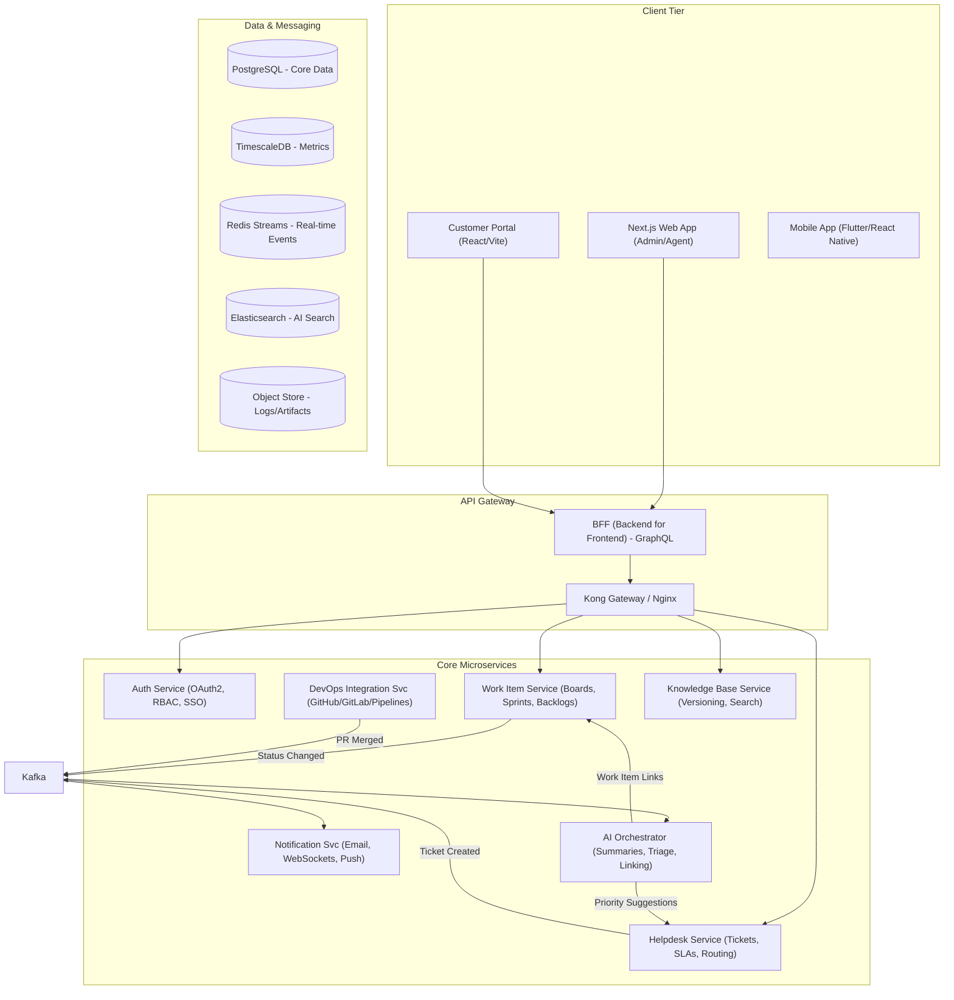
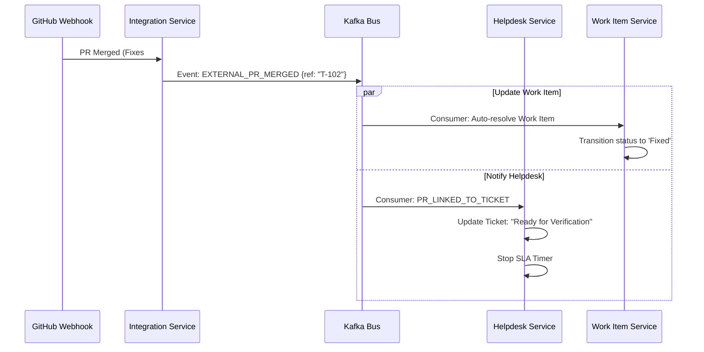

# NexFlow: Unified DevOps & Helpdesk Architecture

This document outlines the architectural blueprint for **NexFlow**, a next-generation platform merging Project Management (DevOps) and Helpdesk functionalities.

## 1. Microservices Architecture Diagram

The system follows a decentralized, event-driven microservices architecture to ensure scalability and independent domain evolution.



### Service Responsibilities
| Service | Responsibility |
| :--- | :--- |
| **Auth Service** | Manages user identities, session tokens (JWT), and fine-grained permissions (RBAC). |
| **Work Item Service** | Handles the lifecycle of Tasks, User Stories, Bugs, and Epics. Manages Kanban/Scrum boards and Sprint states. |
| **Helpdesk Service** | Manages Tickets, SLA timers, customer sentiment, and automated ticket assignment logic. |
| **Integration Service** | Polls/Webhooks for external Git providers (GitHub/GitLab). Maps commits/PRs to internal IDs. |
| **KB Service** | Content management for articles. Supports versioning and exports metadata to Elasticsearch. |
| **AI Orchestrator** | Interface with LLMs (GPT-4/Claude/Gemini) for summarization, sentiment, and auto-triage. |

---

## 2. Recommended Tech Stack

| Layer | Technology Recommendation | Rationale |
| :--- | :--- | :--- |
| **Frontend** | **Next.js 14 (App Router)** | Excellent SEO for KB, built-in routing, and server-side rendering for performance. |
| **Styling** | **Vanilla CSS + CSS Modules** | Maximum performance and flexibility; avoid utility-class bloat in large apps. |
| **Backend** | **Node.js (NestJS) or Go** | NestJS for structured TypeScript (Dev productivity); Go for high-throughput services. |
| **Database** | **PostgreSQL + TimescaleDB** | Postgres for core relations; TimescaleDB for high-velocity metrics/incidents. |
| **Messaging** | **Redis Streams** | Optimized for real-time events and high-throughput streaming. |
| **AI Innovation** | **AI Orchestration Layer** | Routing, prioritization, and smart automation across portals. |
| **Real-time** | **Socket.io / WebSockets** | For live board updates and agent presence. |
| **Infrastructure**| **Kubernetes (K8s)** | Orchestration for microservices with horizontal autoscaling. |

---

## 3. API-First Design (REST/GraphQL)

We recommend a **GraphQL** interface for the frontend to prevent over-fetching, while services communicate via **gRPC** or **REST**.

### Key Work Item Endpoints (REST)
- `GET /api/v1/work-items/{id}`: Fetch detailed item including hierarchy and linked PRs.
- `POST /api/v1/work-items`: Create a new item (Bug, Task, etc.).
- `PATCH /api/v1/work-items/{id}/state`: Transition status (e.g., "To Do" -> "Doing").
- `GET /api/v1/projects/{projectId}/boards/{boardId}`: Fetch board layout and items.

### Key Helpdesk Endpoints (REST)
- `POST /api/v1/tickets`: Create ticket (Public/Internal).
- `GET /api/v1/tickets/{id}/history`: Audit trail of all changes and responses.
- `POST /api/v1/tickets/{id}/escalate`: Manual or automatic SLA escalation.
- `GET /api/v1/search?q={query}`: Global search across tickets and work items.

---

## 4. Database Schemas

### Work Item Schema (Simplified)
```sql
CREATE TABLE work_items (
    id UUID PRIMARY KEY DEFAULT gen_random_uuid(),
    project_id UUID NOT NULL,
    parent_id UUID REFERENCES work_items(id), -- Hierarchy
    title TEXT NOT NULL,
    description TEXT,
    state VARCHAR(50), -- e.g., 'New', 'Active', 'Resolved'
    type VARCHAR(20), -- e.g., 'Epic', 'Story', 'Task', 'Bug'
    assigned_to UUID,
    sprint_id UUID,
    external_refs JSONB, -- Links to GitHub PRs/Commits
    created_at TIMESTAMPTZ DEFAULT now(),
    updated_at TIMESTAMPTZ DEFAULT now()
);
```

### Helpdesk Service Schema (Simplified)
```sql
CREATE TABLE tickets (
    id UUID PRIMARY KEY DEFAULT gen_random_uuid(),
    customer_id UUID NOT NULL,
    subject TEXT NOT NULL,
    content TEXT,
    status VARCHAR(20), -- 'Open', 'Pending', 'Closed'
    priority VARCHAR(10), -- 'Low', 'Medium', 'High', 'Urgent'
    assigned_agent_id UUID,
    sla_deadline TIMESTAMPTZ,
    csat_score INTEGER,
    channel VARCHAR(20), -- 'Email', 'Web', 'API'
    related_work_item_id UUID, -- Cross-domain link
    created_at TIMESTAMPTZ DEFAULT now()
);
```

---

## 5. Event-Driven Communication Model

A critical feature is the **Cross-Domain Automation**.



---

## 6. Phased Development Roadmap

### Phase 1: Foundation (Months 1-3)
- Core Auth & RBAC.
- Basic Work Item CRUD (Tasks only).
- Basic Ticketing (Web form only).
- Infrastructure setup (K8s, Postgres).

### Phase 2: Domain Deepening (Months 4-6)
- Kanban/Scrum Board views.
- Email-to-Ticket integration.
- SLA Engine implementation.
- GitHub/GitLab Webhook integration.

### Phase 3: AI & Optimization (Months 7-9)
- AI Triage & Summarization (LLM Integration).
- Full-Text Search with Elasticsearch.
- Real-time WebSocket updates.
- Advanced reporting dashboards.

### Phase 4: Scaling & Polish (Months 10+)
- Multi-tenancy support.
- Mobile Application.
- Public API / Marketplace for 3rd party plugins.

---

## 7. AI Triage Prompt Engineering Module

Below is a structured prompt for the **AI Triage Agent** to categorize incoming helpdesk tickets and suggest priorities.

```json
{
  "module": "AI_TRIAGE_PROCESSOR",
  "prompt_template": "
    SYSTEM: You are an expert Helpdesk Triage Agent for a unified DevOps platform.
    Your goal is to analyze the incoming ticket and output a JSON object.
    
    USER_TICKET:
    Subject: {{subject}}
    Description: {{description}}
    
    CONSTRAINTS:
    1. Categorize into: [BUG, FEATURE_REQUEST, ACCESS_ISSUE, GENERAL_INQUIRY].
    2. Suggest Priority: [URGENT, HIGH, MEDIUM, LOW]. Use URGENT only if system-wide downtime is mentioned.
    3. Suggest a 1-sentence summary.
    4. Link to existing Work Items if keywords match (e.g., 'login', 'performance').
    
    OUTPUT_FORMAT:
    {
      \"category\": \"string\",
      \"priority\": \"string\",
      \"summary\": \"string\",
      \"confidence\": 0.0-1.0,
      \"suggested_links\": [\"WorkItemID\"]
    }
  "
}
```
